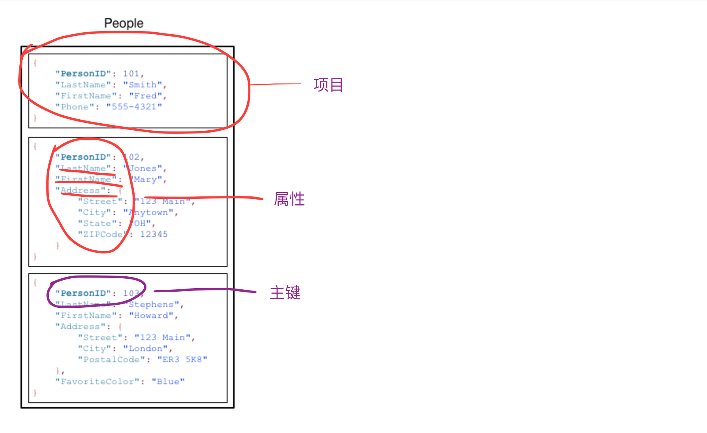

### 什么是 Amazon DynamoDB

Amazon DynamoDB 是一种完全托管的 NoSQL 数据库服务，提供快速而可预测的性能，能够实现无缝扩展。使用 DynamoDB，您可以免除操作和扩展分布式数据库的管理工作负担，因而无需担心硬件预置、设置和配置、复制、软件修补或集群扩展等问题。

使用 DynamoDB，您可以创建数据库表来存储和检索任意量级的数据，并提供任意级别的请求流量。您可以扩展或缩减您的表的吞吐容量，而不会导致停机或性能下降，还可以使用 AWS 管理控制台来监控资源使用情况和各种性能指标。

### Amazon DynamoDB 特点

DynamoDB 会自动将数据和流量分散到足够数量的服务器上，以满足吞吐量和存储需求，同时保持始终如一的高性能。所有数据均存储在固态硬盘 (SSD) 中，并会自动复制到 AWS 区域中的多个可用区中，从而提供内置的高可用性和数据持久性。

DynamoDB 是 NoSQL 数据库并且无架构，这意味着，与主键属性不同，无需在创建表时定义任何属性或数据类型。与此相对，关系数据库要求在创建表时定义每个列的名称和数据类型。

DynamoDB 是一个键/值和文档数据库，可以在任何规模的环境中提供个位数的毫秒级性能。它是一个完全托管、多区域多主的持久数据库，具有适用于 Internet 规模的应用程序的内置安全性、备份和恢复和内存缓存。DynamoDB 每天可处理超过 10 万亿个请求，并可支持每秒超过 2000 万个请求的峰值


### DynamoDB 核心组件

基本 DynamoDB 组件包括：表、项目、属性

表 - 类似于其他数据库系统，DynamoDB将数据存储在表中。表是数据的集合。（类似于关系型数据库中的表）

项目 - 每个表包含多个项目。项目是一组属性，具有不同于所有其他项目的唯一标识。（类似于其他数据库系统中的行、记录或元组。）

属性 - 每个项目包含一个或多个属性。属性是基础的数据元素，无需进一步分解。（类似于其他数据库系统中的字段或列。）

下图是一个名为 People 的表，其中显示了一些示例项目和属性：

请注意有关 People 表的以下内容：



表中的每个项目都有一个唯一的标识符或主键，用于将项目与表中的所有其他内容区分开来。在 People 表中，主键包含一个属性 (PersonID)。

与主键外不同，People表是无架构的，这表示属性及其数据类型都不需要预先定义。每个项目都能拥有其自己的独特属性。

大多数属性是标量类型的，这表示它们只能具有一个值。字符串和数字是标量的常见示例。

某些项目具有嵌套属性 (Address)。DynamoDB 支持最高 32级深度的嵌套属性。

这里，我们将看到第一个概念：主键。

### 主键
创建表时，除表名称外，您还必须指定表的主键。主键唯一标识表中的每个项目，因此，任意两个项目的主键都不相同。
DynamoDB 支持两种不同类型的主键：

* 分区键 - 简单的主键，由一个称为分区键的属性组成。

> 如果表具有简单主键（只有分区键），DynamoDB 将根据其分区键值存储和检索各个项目。同时，DynamoDB 使用分区键的值作为内部哈希函数的输入值，从而将项目写入表中。哈希函数的输出值决定了项目将要存储在哪个分区。

要从表中读取某个项目，必须为该项目指定分区键值。DynamoDB 使用此值作为其哈希函数的输入值，从而生成可从中找到该项目的分区。（此时，分区键必须是唯一的，不可重复。）

下图显示了名为 Pets 的表，该表跨多个分区。表的主键为 AnimalType（仅显示此键属性）。在这种情况下，DynamoDB 会根据字符串 Dog 的哈希值，使用其哈希函数决定新项目的存储位置。请注意，项目并非按排序顺序存储的。每个项目的位置由其分区键的哈希值决定。


* 分区键和排序键 - 称为复合主键，此类型的键由两个属性组成。第一个属性是分区键，第二个属性是排序键。

> DynamoDB 使用分区键值作为对内部哈希函数的输入。来自哈希函数的输出决定了项目将存储到的分区（DynamoDB 内部的物理存储）。具有相同分区键的所有项目按排序键值的排序顺序存储在一起。两个项目可具有相同的分区键值，但这两个项目必须具有不同的排序键值。

为将某个项目写入表中，DynamoDB 会计算分区键的哈希值以确定该项目的存储分区。在该分区中，可能有几个具有相同分区键值的项目，因此 DynamoDB 会按排序键的升序将该项目存储在其他项目中。

要读取表中的某个项目，您必须为该项目指定分区键值和排序键值。DynamoDB 会计算分区键的哈希值，从而生成可从中找到该项目的分区。

如果我们查询的项目具有相同的分区键值，则可以通过单一操作 (Query) 读取表中的多个项目。DynamoDB 将返回具有该分区键值的所有项目。或者，也可以对排序键应用某个条件，以便它仅返回特定值范围内的项目。

假设 Pets 表具有由 AnimalType（分区键）和 Name（排序键）构成的复合主键。

下图显示了 DynamoDB 写入项目的过程，分区键值为 Dog、排序键值为 Fido。


> 为读取 Pets 表中的同一项目，DynamoDB 会计算 Dog 的哈希值，从而生成这些项目的存储分区。然后，DynamoDB 会扫描这些排序键属性值，直至找到 Fido。

> 要读取 AnimalType 为 Dog 的所有项目，您可以执行 Query 操作，无需指定排序键条件。默认情况下，这些项目会按存储顺序（即按排序键的升序）返回。或者，您也可以请求以降序返回。

> 要仅查询某些 Dog 项目，您可以对排序键应用条件（例如，仅限 Name 在 A 至 K 范围内的 Dog 项目）。

Note
* 每个主键属性必须为标量（表示它只能具有一个值）。主键属性唯一允许的数据类型是字符串、数字和二进制。对于其他非键属性没有任何此类限制。

* DynamoDB 会自动分配足够的存储，每个分区键值的非重复排序键值无数量上限。所以即使需要在 Dog 表中存储数十亿 Pets项目，DynamoDB 也能这一需求。

### 二级索引

DynamoDB支持在一个表上创建一个或多个二级索引。利用 secondary index，除了可对主键进行查询外，还可使用替代键查询表中的数据。

DynamoDB 支持两种索引：

* Global secondary index - 一种带有可能与表中不同的分区键和排序键的索引。

* Local secondary index - 一种分区键与表中的相同但排序键与表中的不同的索引。

最多可以为每个表定义 5 个全局二级索引和 5 个本地二级索引。

下图显示了示例 Music 表，该表包含一个名为 GenreAlbumTitle 的新索引


对于Music表，我们不仅可以按 Artist（分区键）或按 Artist 和 SongTitle（分区键和排序键）查询数据项。还可以按 Genre 和 AlbumTitle 查询数据。

Note

请注意有关 GenreAlbumTitle 索引的以下内容：

* 每个索引属于一个表（称为索引的基表）。在上述示例中，Music 是 GenreAlbumTitle 索引的基表。

* DynamoDB 将自动维护索引。当添加、更新或删除基表中的某个项目时，DynamoDB 会添加、更新或删除属于该表的任何索引中的对应项目。

* 当创建索引时，可指定哪些属性将从基表复制或投影到索引。DynamoDB 至少会将键属性从基表投影到索引中。对于 GenreAlbumTitle 也是如此，只不过此时只有 Music 表中的键属性会投影到索引中。

### DynamoDB流

DynamoDB流可以捕获表中的数据修改事件，这些事件以发生的顺序写入到流中。流有生命周期，从计入到结束一共有24小时，到期后将从流中自动删除。

以下几个事件将触发流的产生

向表添加新项目时，此时流会捕获整个项目即所有属性
更新项目时，此时流将波或项目中已修改的属性
删除项目时，流在项目被删除前捕获

### 数据类型

|名称|类型|说明|
|---|---|---|
|N|数字|数字可为正数、负数或零。数字最多可精确到 38 位 - 超过此位数将导致意外|
|S|字符串|字符串是使用 UTF-8 二进制编码的 Unicode。字符串的长度必须大于零且受限于最大 DynamoDB 项目大小 400 KB。|
|BOOL|布尔类型|true/false|
|S|列表|[ {"S": "Cookies"} , {"S": "Coffee"}, {"N", "3.14159"}]|
|SS|字符串列表类型|["S","M","D"]|
|NS|数字列表类型|[1,23,4,5]|
|BS|数字列表类型|[1,23,4,5]|
|Map|KV类型|{"k","v"}|
|B|字节数组|二进制类型属性可以存储任意二进制数据，如压缩文本、加密数据或图像。DynamoDB 会在比较二进制值时将二进制数据的每个字节视为无符号。二进制属性的长度必须大于零且受限于最大 DynamoDB 项目大小 400 KB。|
|NULL|空值| |


### 启动一个本地的Dynamodb

```
docker run -d -p 8000:8000 ryanratcliff/dynamodb
```

### 命令行使用

#### 安装aws-cli

* [下载地址](https://docs.aws.amazon.com/cli/latest/userguide/cli-chap-install.html)

#### 如果线上有aws 可以进行以下设置

```
# 会在 ~/.aws/config产生一条记录

$ aws configure --profile production
AWS Access Key ID [None]: AKIAI44QH8DHBEXAMPLE
AWS Secret Access Key [None]: je7MtGbClwBF/2Zp9Utk/h3yCo8nvbEXAMPLEKEY
Default region name [None]: us-east-1
Default output format [None]: text
```

#### 创建一个表
```
aws dynamodb create-table \
    --endpoint-url http://localhost:8000 \
    --table-name Music \
    --attribute-definitions \
        AttributeName=Artist,AttributeType=S \
        AttributeName=SongTitle,AttributeType=S \
    --key-schema AttributeName=Artist,KeyType=HASH AttributeName=SongTitle,KeyType=RANGE \
    --provisioned-throughput ReadCapacityUnits=10,WriteCapacityUnits=10
```

#### 写入一个项目
```
aws dynamodb put-item \
--table-name Music  \
--item \
    '{"Artist": {"S": "No One You Know"}, "SongTitle": {"S": "Call Me Today"}, "AlbumTitle": {"S": "Somewhat Famous"}}' \
--return-consumed-capacity TOTAL  

aws dynamodb put-item \
    --endpoint-url http://localhost:8000 \
    --table-name Music \
    --item '{ \
        "Artist": {"S": "Acme Band"}, \
        "SongTitle": {"S": "Happy Day"}, \
        "AlbumTitle": {"S": "Songs About Life"} }' \
    --return-consumed-capacity TOTAL 
```

#### 列出所有表
```
aws dynamodb list-tables --endpoint-url http://localhost:8000
```

#### 通过键获取

```
aws dynamodb get-item --consistent-read \
    --endpoint-url http://localhost:8000 \
    --table-name Music \
    --key '{ "Artist": {"S": "Acme Band"}, "SongTitle": {"S": "Happy Day"}}'
 
```

#### 查询数据
```
aws dynamodb query \
    --endpoint-url http://localhost:8000 \
    --table-name Music \
    --key-condition-expression "Artist = :name" \
    --expression-attribute-values  '{":name":{"S":"Acme Band"}}'
```

#### 创建索引
```
aws dynamodb update-table \
    --endpoint-url http://localhost:8000 \
    --table-name Music \
    --attribute-definitions AttributeName=AlbumTitle,AttributeType=S \
    --global-secondary-index-updates \
    "[{\"Create\":{\"IndexName\": \"AlbumTitle-index\",\"KeySchema\":[{\"AttributeName\":\"AlbumTitle\",\"KeyType\":\"HASH\"}], \
    \"ProvisionedThroughput\": {\"ReadCapacityUnits\": 10, \"WriteCapacityUnits\": 5      },\"Projection\":{\"ProjectionType\":\"ALL\"}}}]"
```

#### 查看创建的索引
```
 aws dynamodb describe-table --endpoint-url http://localhost:8000  --table-name Music 
```

#### 查询二级索引数据
```
 aws dynamodb query \
    --table-name Music \
    --index-name AlbumTitle-index \
    --key-condition-expression "AlbumTitle = :name" \
    --expression-attribute-values  '{":name":{"S":"Somewhat Famous"}}'
```

### Python 操作 DynamoDB

#### 安装依赖包

```
pip install boto3
```

#### 初始化客户端

```
import boto3
import json

endpoint_url = "http://localhost:8000"
access_key = ""  # 本地Dynamodb不需要填写
secret_key = ""
region_name = "us-west-2"
client = boto3.client('dynamodb',
                          endpoint_url=endpoint_url,
                          aws_access_key_id=access_key,
                          aws_secret_access_key=secret_key,
                          region_name=region_name,)
```

#### 创建表
```
 table = client.create_table(
    TableName='Music',
    KeySchema=[
        { 
            'AttributeName': "Artist", 
            'KeyType': "HASH"
        },
        { 
            'AttributeName': "SongTitle", 
            'KeyType': "RANGE"
        }
    ],
    AttributeDefinitions=[
        { 
            'AttributeName': "Artist", 
            'AttributeType': "S" 
        },
        { 
            'AttributeName': "SongTitle", 
            'AttributeType': "S" 
        }
    ],
    ProvisionedThroughput={       
        'ReadCapacityUnits': 5, 
        'WriteCapacityUnits': 5
    }
)

```

#### 修改表
```
table = client.update_table(
    TableName='Music',
    AttributeDefinitions=[
        { 
            'AttributeName': "Artist", 
            'AttributeType': "S" 
        },
        { 
            'AttributeName': "SongTitle", 
            'AttributeType': "S" 
        }
    ],
    ProvisionedThroughput={       
        'ReadCapacityUnits': 10, 
        'WriteCapacityUnits': 10
    }
)

client.describe_table(TableName='Music')
```

#### 创建索引
```
table = client.update_table(
    TableName='Music',
    AttributeDefinitions=[
        { 
            'AttributeName': "Genre", 
            'AttributeType': "S" 
        },
        { 
            'AttributeName': "Price", 
            'AttributeType': "N" 
        }
    ],
    GlobalSecondaryIndexUpdates=[
        {
            'Create': {
                'IndexName': "GenreAndPriceIndex",
                'KeySchema': [
                    {'AttributeName': "Genre", 'KeyType': "HASH"},  # Partition key
                    {'AttributeName': "Price", 'KeyType': "RANGE"}, # Sort key
                ],
                'Projection': {
                    "ProjectionType": "ALL"
                },
                'ProvisionedThroughput': {
                    "ReadCapacityUnits": 10,
                    "WriteCapacityUnits": 10
                }
            }
        }
    ]
)

client.describe_table(TableName='Music')
```


#### 获取表信息
```
client.describe_table(TableName='Music')
```

#### 列出所有表

```
tables = client.list_tables()
print(json.dumps(tables))
```

```
{"TableNames": ["Music"], "ResponseMetadata": {"RequestId": "c2473363-433d-4037-8a0e-d103a01a61b5", "HTTPStatusCode": 200, "HTTPHeaders": {"content-type": "application/x-amz-json-1.0", "x-amz-crc32": "2248451684", "x-amzn-requestid": "c2473363-433d-4037-8a0e-d103a01a61b5", "content-length": "100", "server": "Jetty(8.1.12.v20130726)"}, "RetryAttempts": 0}}
```

#### 删除表
```
table = client.delete_table(TableName = 'Music')
```

### 参考文档
* [Dynamodb入门](https://docs.aws.amazon.com/zh_cn/amazondynamodb/latest/developerguide/GettingStarted.CoreComponents.html)
* [Dynamodb官方文档](https://docs.aws.amazon.com/zh_cn/amazondynamodb/latest/developerguide/Introduction.html)
* [Boto3](https://boto3.amazonaws.com/v1/documentation/api/latest/reference/services/dynamodb.html#table)