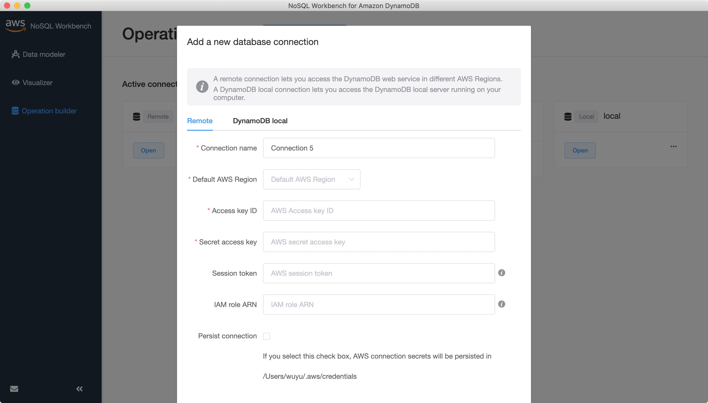
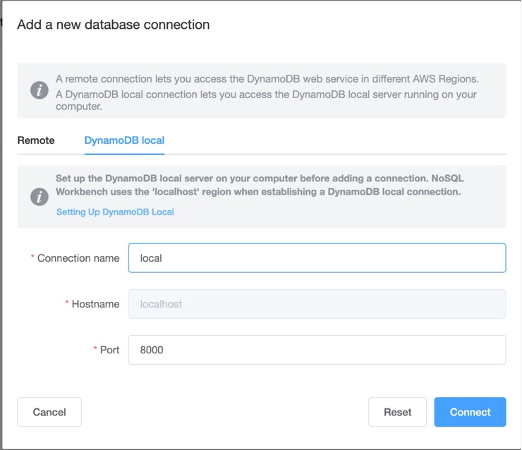
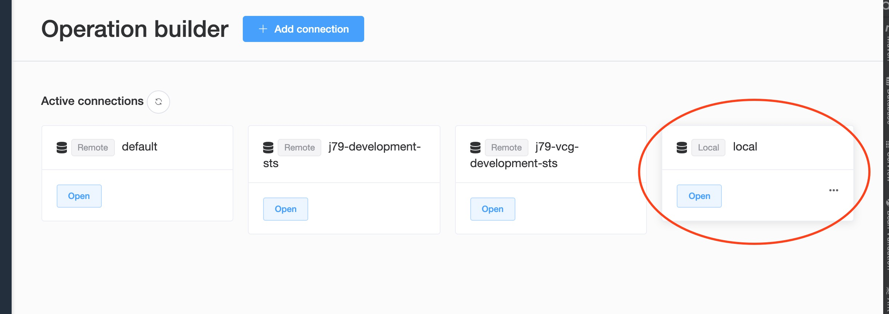
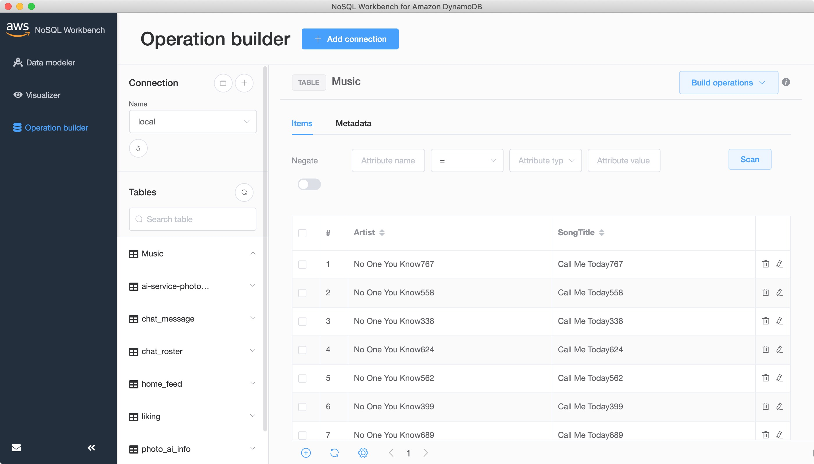
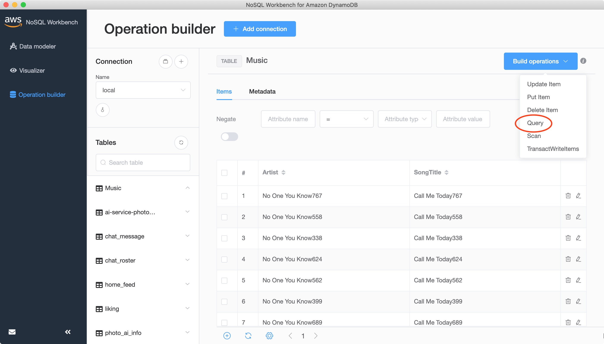
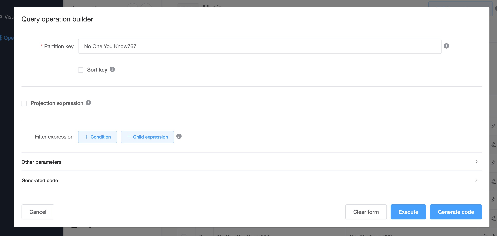
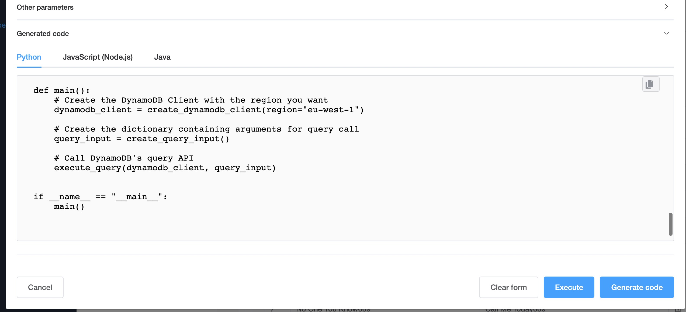

## Dynamodb 图形化客户端

### 下载地址
```
https://docs.aws.amazon.com/zh_cn/amazondynamodb/latest/developerguide/workbench.settingup.html
```

### 添加连接

支持 ***远程***  ***本地*** 两种方式

#### 远程

* connection name 名称 可以随意填写
* Access key ID 可以在aws网站上生成
* Secret key ID 可以在aws网站上生成
* Session token 使用临时凭证时需要的令牌(可选)
* IAM role ARN 如果使用临时凭证所赋予的资源角色(可选)



#### 本地

* 本地Dyamodb比较简单,只需要填写名称 和端口号即可



#### 添加完成后

* 添加完成后 可以直接进入所添加的Dynamodb连接




#### 界面概览



### 功能以及限制

* 可以查看所有表
* 不能创建表
* 不能删除表
* 不能修改表
* 不能创建索引
* 不能删除索引

### 查询


#### 按照条件进行查询



#### 生成查询代码
