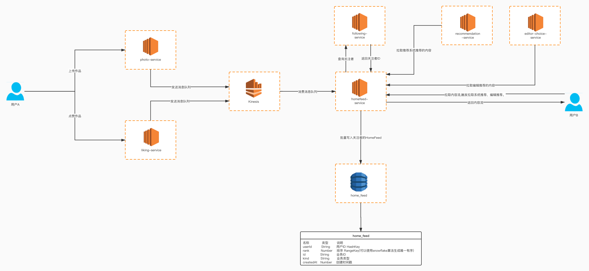

## Dynamodb实现Feed流系统

### 什么是Feed流

在互联网领域，尤其现在的移动互联网时代，Feed流产品非常常见。例如我们每天都会用到的朋友圈、微博就是一种非常典型的Feed流产品，图片分享网站Pinterest、花瓣网等又是另一种形式的Feed流产品。除此之外，很多应用的都会有一个模块，有些叫动态、有些叫消息广场，这些也是Feed流产品。Feed流产品已经被广泛应用在各种主流应用中。

### 基础概念

|概念|描述|
|---|---|
|Feed|Feed流中的每一条状态或者消息都是Feed，例如朋友圈中的一个状态就是一个Feed、微博中的一条微博就是一个Feed。|
|Feed流|持续更新并呈现给用户内容的信息流。每个人的朋友圈、微博关注页等都是一个Feed流。|
|Timeline|Timeline是一种Feed流的类型，微博、朋友圈都是Timeline类型的Feed流。但是由于Timeline类型出现最早、使用最广泛、最为人熟知，有时也用||Timeline来表示Feed流。|
|关注页Timeline|展示其他人Feed消息的页面，例如朋友圈、微博的首页。|
|个人页Timeline|展示自己发送过的Feed消息的页面，例如微信中的相册、微博的个人页。|

### feed流的特点

1. 多账号内容流：系统中有一定量的账号，账号之间存在关注、取关、拉黑等关系

2. 非稳定账号关系：用户间的关系会随时发生变化

3. 读写不平衡：读多写少

4. 消息必达性：必须保证相关用户能看到消息


### 为什么选择Dynamodb

1. 吞吐量和存储空间几乎无限
2. 可自动纵向扩展和缩减表
3. 价格低廉
4. 天然支持排序
5. 支持游标分页,适合下拉内容
6. 每天可处理超过 10 万亿个请求，并可支持每秒超过 2000 万个请求的峰值

### feed流系统设计




#### 推送

1. 拉模式

许多feed流系统初版会基于拉模式，因为用户数较少且日活低，拉取成本较低

2. 推模式

用户关系数比较均匀，且有上限，如朋友圈

偏向推荐类feed，同一个feed对不同用户价值不同，计算feed和用户间的分数，只推荐给分数较高的用户

推拉结合模式：大部分用户关系数比较均匀，少数用户千万级别，无上限。例如微博。能够解决单纯采用推模式时大V用户高并发写问题。

以微博为例，使用两种推拉模式：

① 在线推，离线拉：大V发布动态后，有限推送给同时在线的粉丝，离线粉丝上线后再拉取该动态。


② 定时推，离线拉：大V发布动态后，以常驻进程的形式推送到粉丝关注。


#### 表结构设计

|名称|类型|说明|
|---|---|---|
|userId|String|分区键 HashKey，用户的消息存放在相同的分区查询时|
|rank|Number|排序键 SortKey 可以使用Snowflake 算法生成,让数据保证有序,同时保证唯一性|
|id|String|业务ID|
|kind|String|业务类型|
|createdAt|Number|创建时间,用时间戳表示|

> 线上系统有可能会出现对Feed流推重复的数据，如果有去重的需求可以更改成以下表结构,查询时使用全局索引进行查询


|名称|类型|说明|
|---|---|---|
|userId|String|全局索引 分区键|
|rank|Number|全局索引 排序键|
|id|String|业务ID,排序键 SortKey|
|kind|String|业务类型,分区键 HashKey|
|createdAt|Number|创建时间,用时间戳表示|


### 启动一个本地的Dynamodb

```
docker run -d -p 8000:8000 ryanratcliff/dynamodb
```

#### 安装依赖包

```
pip install boto3
```

#### 创建表
```
def create_table(client):
    client.create_table(
        TableName='home_feed',
        KeySchema=[
            { 
                'AttributeName': "userId", 
                'KeyType': "HASH"
            },
            { 
                'AttributeName': "rank", 
                'KeyType': "RANGE"
            }
        ],
        AttributeDefinitions=[
            { 
                'AttributeName': "userId", 
                'AttributeType': "S" 
            },
            { 
                'AttributeName': "rank", 
                'AttributeType': "N" 
            }
        ],
        ProvisionedThroughput={       
            'ReadCapacityUnits': 5, 
            'WriteCapacityUnits': 5
        }
    )
```

#### 写入测试数据

```
def importData(client):
    # 使用时间戳代替rank,正式环境请使用snowflake算法生成有序rank
    for i in range(100):
        created_at = int(round(time.time() * 1000))
        rank = int(round(time.time() * 1000000))
        item = {'userId':{'S':'1'},'rank':{'N':str(rank)},'id':{'N':str(i)},'kind':{'S':'photo'},'createdAt':{'N':str(created_at)}}
        client.put_item(TableName='home_feed',Item=item)
```

#### 拉取用户瀑布流数据

```
def query(client,user_id,size,lastEvaluatedKey):
    conditions = {
        'userId':{
            'AttributeValueList':[
                {
                    'S': user_id
                }
            ],
            'ComparisonOperator': 'EQ'
        }
    }

    if lastEvaluatedKey!= None:
        return client.query(
                TableName='home_feed',
                Limit=size,
                KeyConditions=conditions,
                ConsistentRead=False,
                ScanIndexForward=False,
                ExclusiveStartKey=lastEvaluatedKey)

    return client.query(
        TableName='home_feed',
        Limit=size,
        KeyConditions=conditions,
        ConsistentRead=False,
        ScanIndexForward=False)

```

#### 主函数
```
endpoint_url = "http://localhost:8000"
access_key = ""  # 本地Dynamodb不需要填写
secret_key = ""
region_name = "us-west-2"
client = boto3.client('dynamodb',
                          endpoint_url=endpoint_url,
                          aws_access_key_id=access_key,
                          aws_secret_access_key=secret_key,
                          region_name=region_name,)

response = query(client,'1',20,None)
print(json.dumps(response["Items"],indent=4))

#模拟用户不断下拉数据,使用LastEvaluatedKey游标
while 'LastEvaluatedKey' in response:
    response = query(client,'1',20,response['LastEvaluatedKey'])
    print(json.dumps(response["Items"],indent=4))
```

#### 完整代码

* [创建表](./src/home_feed/create_table.py)
* [HomeFeed](./src/home_feed/home_feed.py)