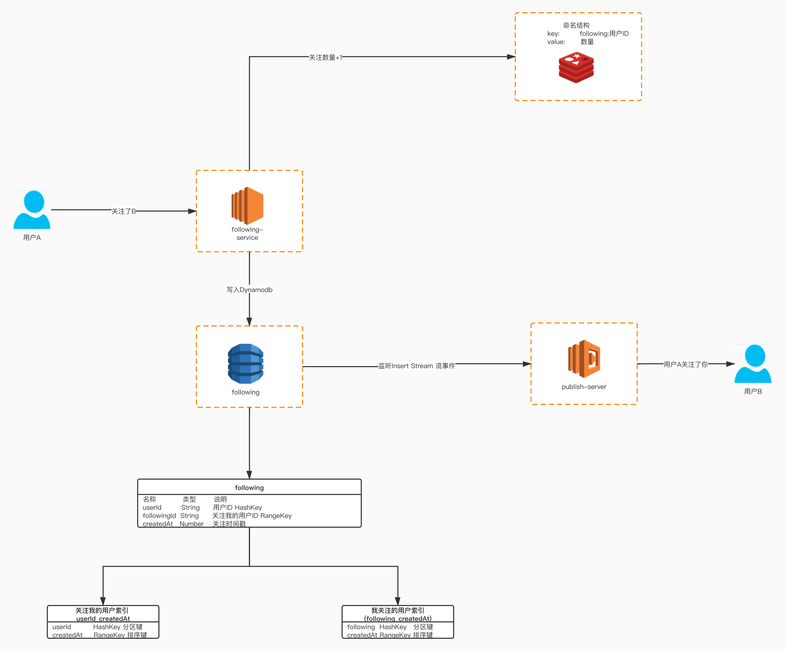

## Dynamodb实现关注系统

### 介绍

关注在社交类平台中，作为一个最常见的操作，每天会有成千上万的操作。如果每次都将操作写入数据库，那么对于数据库会形成很大的操作负担。本文介绍如何通过Dynamodb构建一个关注系统。


### 为什么选择Dynamodb

1. 吞吐量和存储空间几乎无限
2. 可自动纵向扩展和缩减表
3. 价格低廉
4. 天然支持排序
5. 支持游标分页,适合下拉内容
6. 每天可处理超过 10 万亿个请求，并可支持每秒超过 2000 万个请求的峰值


### 架构图




#### 表结构设计

|名称|类型|说明|
|---|---|---|
|userId|String|用户ID HashKey|
|followingId|String|关注我的用户ID RangeKey|
|createdAt|Number|关注时间|

#### 关注我的用户索引(userId_createdAt)

> 查询关注我的用户,按照时间倒序

|名称|说明|
|---|---|
|userId|HashKey 分区键|
|createdAt|RangeKey 排序键|


#### 我关注的用户索引(following_createdAt)

> 查询我关注的用户,按照时间倒序

|名称|说明|
|---|---|
|followingId|HashKey 分区键|
|createdAt|RangeKey 排序键|


### 启动一个本地的Dynamodb

```
docker run -d -p 8000:8000 ryanratcliff/dynamodb
```

#### 安装依赖包

```
pip install boto3
```

#### 创建表
```
def create_table(client):
    client.create_table(
        TableName='following',
        KeySchema=[
            { 
                'AttributeName': 'userId', 
                'KeyType': 'HASH'
            },
            { 
                'AttributeName': 'followingId', 
                'KeyType': 'RANGE'
            }
        ],
        AttributeDefinitions=[
            { 
                'AttributeName': 'userId', 
                'AttributeType': 'S' 
            },
            { 
                'AttributeName': 'followingId', 
                'AttributeType': 'S' 
            }
        ],
        ProvisionedThroughput={       
            'ReadCapacityUnits': 5, 
            'WriteCapacityUnits': 5
        }
    )

```


#### 创建索引 用于查询关注我的用户（userId_createdAt）
```
def created_user_id_created_at_index(client):
    client.update_table(
        TableName='following',
        AttributeDefinitions=[
            { 
                'AttributeName': 'userId', 
                'AttributeType': 'S' 
            },
            { 
                'AttributeName': 'createdAt', 
                'AttributeType': 'N' 
            }
        ],
        GlobalSecondaryIndexUpdates=[
            {
                'Create': {
                    'IndexName': 'userId_createdAt',
                    'KeySchema': [
                        {'AttributeName': 'userId', 'KeyType': 'HASH'},  
                        {'AttributeName': 'createdAt', 'KeyType': 'RANGE'},
                    ],
                    'Projection': {
                        'ProjectionType': 'ALL'
                    },
                    'ProvisionedThroughput': {
                        'ReadCapacityUnits': 10,
                        'WriteCapacityUnits': 10
                    }
                }
            }
        ]
    )
```


#### 创建索引 用于查询我关注的用户(followingId_createdAt
```
def created_following_id_created_at_index(client):
    client.update_table(
        TableName='following',
        AttributeDefinitions=[
            { 
                'AttributeName': 'followingId', 
                'AttributeType': 'S'
            },
            { 
                'AttributeName': 'createdAt', 
                'AttributeType': 'N'
            }
        ],
        GlobalSecondaryIndexUpdates=[
            {
                'Create': {
                    'IndexName': 'followingId_createdAt',
                    'KeySchema': [
                        {'AttributeName': 'followingId', 'KeyType': 'HASH'},  
                        {'AttributeName': 'createdAt', 'KeyType': 'RANGE'},
                    ],
                    'Projection': {
                        'ProjectionType': 'ALL'
                    },
                    'ProvisionedThroughput': {
                        'ReadCapacityUnits': 10,
                        'WriteCapacityUnits': 10
                    }
                }
            }
        ]
    )

```

#### 写入测试数据

```
def importData(client):
    for following_id in range(1,30):
        for user_id in range(1,30):
            if following_id==user_id:
                continue
            following(client,str(following_id),str(user_id))

```

#### 关注
```

"""
关注
user_id: 被关注的用户
following_id: 发起关注的用户
"""
def following(client,user_id,following_id):
    created_at = int(round(time.time() * 1000))
    item = {'userId':{'S':user_id},'followingId':{'S':following_id},'createdAt':{'N':str(created_at)}}
    client.put_item(TableName='following',Item=item)

```


#### 取消关注
```
"""
取消关注
user_id: 被关注的用户
following_id: 发起关注的用户
"""
def unfollowing(client,user_id, following_id):
    client.delete_item(
        Key={
            'userId': {
                'S': user_id,
            },
            'id': {
                'S': following_id,
            },
        },
        TableName='following',
    )
```


#### 查询关注我的用户
```
"""
查询关注我的用户 按时间倒序
user_id: 用户ID
size: 数量
lastEvaluatedKey: 游标
"""
def query_by_user_id(client,user_id,size,lastEvaluatedKey):
    conditions = {
        'userId':{
            'AttributeValueList':[
                {
                    'S': user_id
                }
            ],
            'ComparisonOperator': 'EQ'
        }
    }

    if lastEvaluatedKey!= None:
        return client.query(
                TableName='following',
                IndexName='userId_createdAt', #使用索引
                Limit=size,
                KeyConditions=conditions,
                ConsistentRead=False,
                ScanIndexForward=False,
                ExclusiveStartKey=lastEvaluatedKey)

    return client.query(
        TableName='following',
        IndexName='userId_createdAt',  #使用索引
        Limit=size,
        KeyConditions=conditions,
        ConsistentRead=False,
        ScanIndexForward=False)
 
```


#### 查询我关注的用户
```

"""
查询我关注的用户 按时间倒序
following_id: 用户ID
size: 数量
lastEvaluatedKey: 游标
"""
def query_by_following_id(client,following_id,size,lastEvaluatedKey):
    conditions = {
        'followingId':{
            'AttributeValueList':[
                {
                    'S': following_id
                }
            ],
            'ComparisonOperator': 'EQ'
        }
    }

    if lastEvaluatedKey!= None:
        return client.query(
                TableName='following',
                IndexName='followingId_createdAt', #使用索引
                Limit=size,
                KeyConditions=conditions,
                ConsistentRead=False,
                ScanIndexForward=False,
                ExclusiveStartKey=lastEvaluatedKey)

    return client.query(
        TableName='following',
        IndexName='followingId_createdAt',  #使用索引
        Limit=size,
        KeyConditions=conditions,
        ConsistentRead=False,
        ScanIndexForward=False)

```


#### 主函数
```

endpoint_url = "http://localhost:8000"
access_key = ""  # 本地Dynamodb不需要填写
secret_key = ""
region_name = "us-west-2"
client = boto3.client('dynamodb',
                          endpoint_url=endpoint_url,
                          aws_access_key_id=access_key,
                          aws_secret_access_key=secret_key,
                          region_name=region_name,)

# 删除表
# table = client.delete_table(TableName = 'following')

create_table(client)
created_user_id_created_at_index(client)
# Dynamodb 有建时间限制 休眠3秒

time.sleep(3)
created_following_id_created_at_index(client)
# Dynamodb 有建时间限制 休眠3秒
time.sleep(3)

# 导入测试数据
importData(client)

# 查询我关注的用户
response = query_by_user_id(client,'1',20,None)
print(json.dumps(response["Items"],indent=4))

# 模拟用户不断下拉数据,使用LastEvaluatedKey游标
while 'LastEvaluatedKey' in response:
    response = query_by_user_id(client,'1',20,response['LastEvaluatedKey'])
    print(json.dumps(response["Items"],indent=4))

# 查询关注我的用户
response = query_by_following_id(client,'1',20,None)
print(json.dumps(response["Items"],indent=4))

# 模拟用户不断下拉数据,使用LastEvaluatedKey游标
while 'LastEvaluatedKey' in response:
    response = query_by_following_id(client,'1',20,response['LastEvaluatedKey'])
    print(json.dumps(response["Items"],indent=4))

```

#### 完整代码

* [Follwing](./src/following.py)