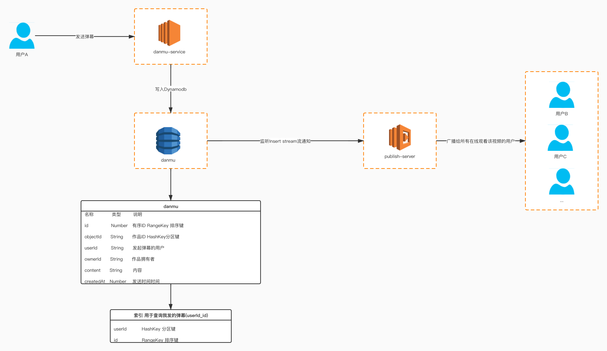

## Dynamodb实现弹幕系统

### 介绍

弹幕在视频平台,是一个比较常见的互动操作。与特别相似，可以按照评论的结构进行设计. 或者直接使用评论系统,这样发送的弹幕也可以作为评论查看.本文介绍如何通过Dynamodb构建一个弹幕系统。

### 为什么选择Dynamodb

1. 吞吐量和存储空间几乎无限
2. 可自动纵向扩展和缩减表
3. 价格低廉
4. 天然支持排序
5. 支持游标分页,适合下拉内容
6. 每天可处理超过 10 万亿个请求，并可支持每秒超过 2000 万个请求的峰值

### 架构




#### 表结构设计


|名称|类型|说明|
|---|---|---|
|id|Number|弹幕ID (当前播放时间字符串+当前时间戳字符串+一个随机数字符串)生成有序ID RangeKey 排序键|
|objectId|String|作品ID HashKey分区键|
|userId|String|发起弹幕的用户|
|ownerId|String|作品拥有者|
|content|String|内容 :{ "text":"haha" ,"color":"yellow","size":"40px","position":1,"time":14}|
|createdAt|Number|发送时间|

#### 创建索引(userId_id)

> 查询我发的弹幕

|名称|说明|
|---|---|
|userId|HashKey 分区键|
|id|RangeKey 排序键|


### 启动一个本地的Dynamodb

```
docker run -d -p 8000:8000 ryanratcliff/dynamodb
```

#### 安装aws dynamodb客户端包

```
pip install boto3
```

#### 安装WebSocket库

```
pip install flask-socketio
```


### 演示

#### 建表

```
python ./src/danmu/create_table.py
```

#### 启动服务

```
python ./src/danmu/danmu.py
```

#### 访问页面

```
http://localhost:5000
```

#### 发送弹幕

```
curl "http://localhost:5000/danmu/send" -H 'Content-Type:application/json' --data-binary '{"objectId":"1","userId":"1","ownerId":"1","content":{ "text":"haha" ,"color":"yellow","size":"40px","position":1,"time":14}}'
```


#### 根据时间拉取弹幕

```
curl "http://localhost:5000/danmu/queryByTime/1?playingTime=20"
```


#### 根据游标弹幕

```
curl http://localhost:5000/danmu/pull/1
```

#### 效果图


#### 创建表
```

def create_table(client):
    client.create_table(
        TableName='danmu',
        KeySchema=[
            { 
                'AttributeName': 'objectId', 
                'KeyType': 'HASH'
            },
            { 
                'AttributeName': 'id', 
                'KeyType': 'RANGE'
            }
        ],
        AttributeDefinitions=[
            { 
                'AttributeName': 'objectId', 
                'AttributeType': 'S' 
            },
            { 
                'AttributeName': 'id', 
                'AttributeType': 'N' 
            }
        ],
        ProvisionedThroughput={       
            'ReadCapacityUnits': 5, 
            'WriteCapacityUnits': 5
        }
    )


```


#### 创建索引(userId_id)

> 用于查询我的弹幕

```
def created_user_id_id_index(client):
    client.update_table(
        TableName='danmu',
        AttributeDefinitions=[
            { 
                'AttributeName': 'userId', 
                'AttributeType': 'S' 
            },
            { 
                'AttributeName': 'id', 
                'AttributeType': 'N' 
            }
        ],
        GlobalSecondaryIndexUpdates=[
            {
                'Create': {
                    'IndexName': 'userId_id',
                    'KeySchema': [
                        {'AttributeName': 'userId', 'KeyType': 'HASH'},  
                        {'AttributeName': 'id', 'KeyType': 'RANGE'},
                    ],
                    'Projection': {
                        'ProjectionType': 'ALL'
                    },
                    'ProvisionedThroughput': {
                        'ReadCapacityUnits': 10,
                        'WriteCapacityUnits': 10
                    }
                }
            }
        ]
    )


```

#### 发送弹幕

```

"""
curl "http://localhost:5000/danmu/send" -H 'Content-Type:application/json' --data-binary '{"objectId":"1","userId":"1","ownerId":"1","content":{ "text":"haha" ,"color":"yellow","size":"40px","position":1,"time":14}}'
"""
@app.route('/danmu/send',methods=['POST'])
def send():
    body = request.get_json()

    body['id'] = generate_id(body['content']['time'])

    body['createdAt']=int(time.time()*1000)
    
    item = encode(body)
    client.put_item(TableName='danmu',Item=item)
    # 发送给正在观看这个视频的用户
    socketio.emit('message', body, namespace='/video/'+body["objectId"])
    return body
```

#### 根据当前播放时间拉取弹幕

```
@app.route('/danmu/queryByTime/<object_id>',methods=['GET'])
def query_by_time(object_id):
    size = int(request.args.get('size','20'))
    playing_time = float(request.args.get('playingTime','1'))
    conditions = {
        'objectId':{
            'AttributeValueList':[
                {
                    'S': object_id
                }
            ],
            'ComparisonOperator': 'EQ'
        },
        "id":{
            'AttributeValueList':[
                {
                    'N': str(generate_id(playing_time)) # 大于或等于客户端播放时间的弹幕
                }
            ],
            'ComparisonOperator': 'GT'
        }
    }

    query_result = client.query(
            TableName='danmu',
            Limit=size,
            KeyConditions=conditions,
            ConsistentRead=False,
            ScanIndexForward=True) # 按照ID正序排列

    data= []
    items = query_result['Items']
    for item in items:
        data.append(decode(item))
        
    # 查看是否还有下一页,如果有下一页 把游标返回给客户端使用
    if 'LastEvaluatedKey' in query_result:
        cursor = query_result['LastEvaluatedKey']['id']['N']
    else :
        # 没有游标 直接返回-1
        cursor = '-1'    
    return {'data':data,'cursor':cursor}

```

#### 根据游标拉取弹幕
```

"""
根据游标拉取弹幕 按id正序 curl http://localhost:5000/danmu/pull/1
object_id: 作品ID
size: 数量
cursor: 游标
"""
@app.route('/danmu/pull/<object_id>',methods=['GET'])
def pull(object_id):
    cursor = request.args.get('cursor')
    
    # 如果没有游标,直接按照时间查询
    if(cursor==None):
        return query_by_time(object_id)
    size = int(request.args.get('size','20'))
    conditions = {
        'objectId':{
            'AttributeValueList':[
                {
                    'S': object_id
                }
            ],
            'ComparisonOperator': 'EQ'
        }
    }

    query_result = client.query(
            TableName='danmu',
            Limit=size,
            KeyConditions=conditions,
            ConsistentRead=False,
            ScanIndexForward=True, # 按照ID正序排列
            ExclusiveStartKey={'objectId':{'S':object_id},'id':{"N":cursor}})
    data= []
    items = query_result['Items']
    for item in items:
        data.append(decode(item))
        
    # 查看是否还有下一页,如果有下一页 把游标返回给客户端使用
    if 'LastEvaluatedKey' in query_result:
        cursor = query_result['LastEvaluatedKey']['id']['N']
    else :
        # 没有游标 直接返回-1
        cursor = '-1'    
    return {'data':data,'cursor':cursor}

```

#### 生成唯一ID
```
"""
生成唯一有序ID
int(当前播放时间字符串+当前时间戳字符串+一个随机数字符串)
"""
def generate_id(playing_time):
   return int(str(int(playing_time)) + str(int(time.time()*1000))+ str(random.randint(0,9)))
```

#### json对象与dynamodb对象互转
```

def encode(item):
    id = item['id']
    object_id = item['objectId']
    user_id = item['userId']
    owner_id = item['ownerId']
    content = item['content']
    created_at = item['createdAt']

    return {
            'id':{'N':str(id)},
            'objectId':{'S':object_id},
            'userId':{'S':user_id},
            'ownerId':{'S':owner_id},
            'content':{'S':json.dumps(content)},
            'createdAt':{'N':str(created_at)}
           }

def decode(item):
    m = {}
    m['id'] = int(item['id']['N'])
    m['objectId'] = item['objectId']['S']
    m['userId'] = item['userId']['S']
    m['ownerId'] = item['ownerId']['S']
    m['content'] = json.loads(item['content']['S'])
    m['createdAt'] = int(item['createdAt']['N'])
    return m
```


#### 完整代码

* [创建表](./src/danmu/create_table.py)
* [Danmu](./src/danmu/danmu.py)
* [网页](./src/danmu/static)

### 参考文档

* [Flask](https://flask.palletsprojects.com/en/1.1.x/api/#incoming-request-data)
* [Flask-SocketIO](https://flask-socketio.readthedocs.io/en/latest/)
* [SocketIO-Client](https://github.com/socketio/socket.io-client/blob/master/docs/API.md)
