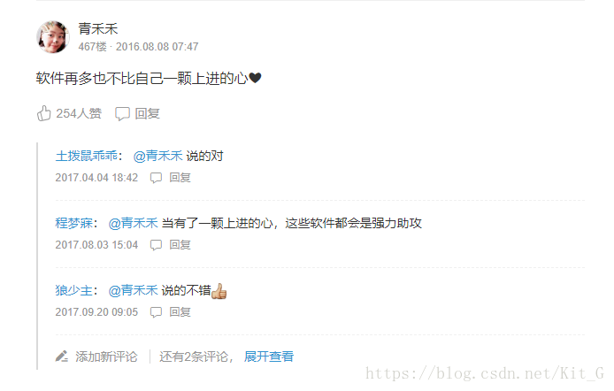
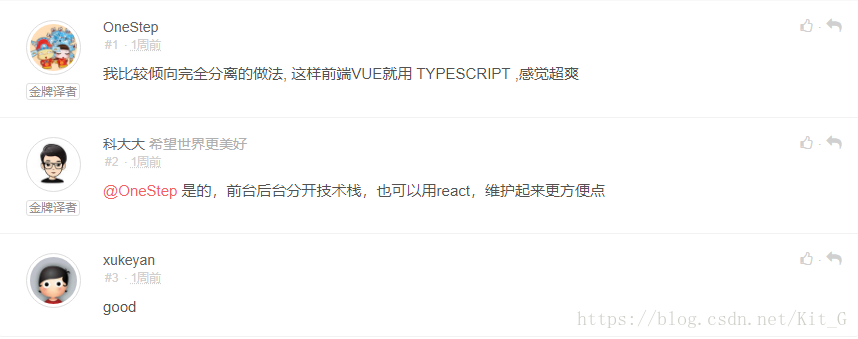

## Dynamodb实现Feed流系统

### 介绍

评论在社交类平台中，作为一个最常见的操作，每天会有成千上万的操作。如果每次都将操作写入数据库，那么对于数据库会形成很大的操作负担。本文介绍如何通过Dynamodb构建一个评论系统。


### 为什么选择Dynamodb

1. 吞吐量和存储空间几乎无限
2. 可自动纵向扩展和缩减表
3. 价格低廉
4. 天然支持排序
5. 支持游标分页,适合下拉内容
6. 每天可处理超过 10 万亿个请求，并可支持每秒超过 2000 万个请求的峰值

### 常见的评论系统

#### 楼中楼模式

每条评论占一楼，针对该评论的所有回复都在该楼里展现，比如百度贴吧、简书的评论系统



优势：回复评论的内容集中展现，易于了解评论引发的对话。
劣势：内容过多时需要做分页处理，较为复杂。


#### 流模式(本文将采用的模式)

展现形式类似于信息流，不管是评论还是回复，每条信息都占一层，比如laravel-china社区的评论系统。



优势： 逻辑简单，实现较为容易
劣势： 对话内容不能集中呈现，不便于了解对话内容。


#### 引用模式

引用模式与流模式相似，只是回复的内容发布时会带上引用的内容。


优势：可以理解回复针对的是哪条评论，有助于了解对话内容。实现相对容易。
劣势：与流模式相似，不能完整呈现整个对话内容。
通过分析优劣势可以发现，引用模式是介于楼中楼以及流模式之间的一个折中方案。


#### 表结构设计

|名称|类型|说明|
|---|---|---|
|id|Number|评论ID 由snowflack雪花算法生成有序ID RangeKey 排序键|
|objectId|String|作品ID HashKey分区键|
|userId|String|发起评论的用户|
|ownerId|String|作品拥有者|
|replyId|String|回复指定用户ID|
|content|String|内容|
|kind|String|分类 photo/gellery/user|
|createdAt|Number|关注时间|


#### 创建索引(userId_id)

> 用于查询我评论的作品

|名称|说明|
|---|---|
|userId|HashKey 分区键|
|id|RangeKey 排序键|


#### 创建索引(ownerId_id)

> 查询我被评论的作品

|名称|说明|
|---|---|
|ownerId|HashKey 分区键|
|id|RangeKey 排序键|


### 启动一个本地的Dynamodb

```
docker run -d -p 8000:8000 ryanratcliff/dynamodb
```

#### 安装依赖包

```
pip install boto3
```

#### 创建表
```
def create_table(client):
    client.create_table(
        TableName='comment',
        KeySchema=[
            { 
                'AttributeName': 'objectId', 
                'KeyType': 'HASH'
            },
            { 
                'AttributeName': 'id', 
                'KeyType': 'RANGE'
            }
        ],
        AttributeDefinitions=[
            { 
                'AttributeName': 'objectId', 
                'AttributeType': 'S' 
            },
            { 
                'AttributeName': 'id', 
                'AttributeType': 'N' 
            }
        ],
        ProvisionedThroughput={       
            'ReadCapacityUnits': 5, 
            'WriteCapacityUnits': 5
        }
    )

```


#### 创建索引(userId_id)

> 用于查询我评论的作品

```
def created_user_id_id_index(client):
    client.update_table(
        TableName='comment',
        AttributeDefinitions=[
            { 
                'AttributeName': 'userId', 
                'AttributeType': 'S' 
            },
            { 
                'AttributeName': 'id', 
                'AttributeType': 'N' 
            }
        ],
        GlobalSecondaryIndexUpdates=[
            {
                'Create': {
                    'IndexName': 'userId_id',
                    'KeySchema': [
                        {'AttributeName': 'userId', 'KeyType': 'HASH'},  
                        {'AttributeName': 'id', 'KeyType': 'RANGE'},
                    ],
                    'Projection': {
                        'ProjectionType': 'ALL'
                    },
                    'ProvisionedThroughput': {
                        'ReadCapacityUnits': 10,
                        'WriteCapacityUnits': 10
                    }
                }
            }
        ]
    )

```

#### 创建索引(userId_id)

> 查询我被评论的作品

```
def created_owner_id_id_index(client):
    client.update_table(
        TableName='comment',
        AttributeDefinitions=[
            { 
                'AttributeName': 'ownerId', 
                'AttributeType': 'S'
            },
            { 
                'AttributeName': 'id', 
                'AttributeType': 'N'
            }
        ],
        GlobalSecondaryIndexUpdates=[
            {
                'Create': {
                    'IndexName': 'ownerId_id',
                    'KeySchema': [
                        {'AttributeName': 'ownerId', 'KeyType': 'HASH'},  
                        {'AttributeName': 'id', 'KeyType': 'RANGE'},
                    ],
                    'Projection': {
                        'ProjectionType': 'ALL'
                    },
                    'ProvisionedThroughput': {
                        'ReadCapacityUnits': 10,
                        'WriteCapacityUnits': 10
                    }
                }
            }
        ]
    )

```


#### 写入测试数据

```
def importData(client):
    for user_id in range(2,30):
        comment(client,'1',str(user_id),'1',str(user_id)+"_hello")

```

#### 评论接口

```

"""
评论
object_id 作品ID
user_id: 评论用户
owner_id: 作品拥有者
"""
def comment(client,object_id,user_id,owner_id,content):
    # 使用纳秒作为id,线上请使用snowflack算法进行生成有序id
    id = int(round(time.time() * 1000000))
    created_at = int(round(time.time() * 1000))
    item = {
        'id':{'N':str(id)},
        'objectId':{'S':object_id},
        'userId':{'S':user_id},
        'ownerId':{'S':owner_id},
        'content':{'S':content},
        'createdAt':{'N':str(created_at)}
        }
    client.put_item(TableName='comment',Item=item)
```

#### 删除评论
```

"""
删除评论
id: 评论ID
object_id: 作品ID
"""
def delete(client,id, object_id):
    client.delete_item(
        Key={
            'userId': {
                'N': id,
            },
            'id': {
                'S': object_id,
            },
        },
        TableName='comment',
    )

```


#### 查询评论作品的用户

```

"""
查询评论作品的用户 按id倒序
object_id: 作品ID
size: 数量
lastEvaluatedKey: 游标
"""
def query_by_object_id(client,object_id,size,lastEvaluatedKey):
    conditions = {
        'objectId':{
            'AttributeValueList':[
                {
                    'S': object_id
                }
            ],
            'ComparisonOperator': 'EQ'
        }
    }

    if lastEvaluatedKey!= None:
        return client.query(
                TableName='comment',
                Limit=size,
                KeyConditions=conditions,
                ConsistentRead=False,
                ScanIndexForward=False,
                ExclusiveStartKey=lastEvaluatedKey)

    return client.query(
        TableName='comment',
        Limit=size,
        KeyConditions=conditions,
        ConsistentRead=False,
        ScanIndexForward=False)
 
```


#### 查询我评论的作品
```

"""
查询我评论的作品 按id倒序
user_id: 用户ID
size: 数量
lastEvaluatedKey: 游标
"""
def query_by_user_id(client,user_id,size,lastEvaluatedKey):
    conditions = {
        'userId':{
            'AttributeValueList':[
                {
                    'S': user_id
                }
            ],
            'ComparisonOperator': 'EQ'
        }
    }

    if lastEvaluatedKey!= None:
        return client.query(
                TableName='comment',
                IndexName='userId_id', #使用索引
                Limit=size,
                KeyConditions=conditions,
                ConsistentRead=False,
                ScanIndexForward=False,
                ExclusiveStartKey=lastEvaluatedKey)

    return client.query(
        TableName='comment',
        IndexName='userId_id',  #使用索引
        Limit=size,
        KeyConditions=conditions,
        ConsistentRead=False,
        ScanIndexForward=False)
 
```

#### 查询我被评论的作品
```

"""
查询我被评论的作品 按时间倒序
owner_id: 作品拥有者
size: 数量
lastEvaluatedKey: 游标
"""
def query_by_owner_id_id(client,owner_id,size,lastEvaluatedKey):
    conditions = {
        'ownerId':{
            'AttributeValueList':[
                {
                    'S': owner_id
                }
            ],
            'ComparisonOperator': 'EQ'
        }
    }

    if lastEvaluatedKey!= None:
        return client.query(
                TableName='comment',
                IndexName='ownerId_id', #使用索引
                Limit=size,
                KeyConditions=conditions,
                ConsistentRead=False,
                ScanIndexForward=False,
                ExclusiveStartKey=lastEvaluatedKey)

    return client.query(
        TableName='comment',
        IndexName='ownerId_id',  #使用索引
        Limit=size,
        KeyConditions=conditions,
        ConsistentRead=False,
        ScanIndexForward=False)

```

#### 主函数
```
 
endpoint_url = "http://localhost:8000"
access_key = ""  # 本地Dynamodb不需要填写
secret_key = ""
region_name = "us-west-2"
client = boto3.client('dynamodb',
                          endpoint_url=endpoint_url,
                          aws_access_key_id=access_key,
                          aws_secret_access_key=secret_key,
                          region_name=region_name,)


# 查询评论作品的用户
response = query_by_object_id(client,'1',20,None)
print(json.dumps(response["Items"],indent=4))

#模拟用户不断下拉数据,使用LastEvaluatedKey游标
while 'LastEvaluatedKey' in response:
    response = query_by_object_id(client,'1',20,response['LastEvaluatedKey'])
    print(json.dumps(response["Items"],indent=4))


# 查询我评论的作品
response = query_by_user_id(client,'1',20,None)
print(json.dumps(response["Items"],indent=4))

#模拟用户不断下拉数据,使用LastEvaluatedKey游标
while 'LastEvaluatedKey' in response:
    response = query_by_user_id(client,'1',20,response['LastEvaluatedKey'])
    print(json.dumps(response["Items"],indent=4))

# 查询评论我的作品用户
response = query_by_owner_id_id(client,'1',20,None)
print(json.dumps(response["Items"],indent=4))

#模拟用户不断下拉数据,使用LastEvaluatedKey游标
while 'LastEvaluatedKey' in response:
    response = query_by_owner_id_id(client,'1',20,response['LastEvaluatedKey'])
    print(json.dumps(response["Items"],indent=4))

```

#### 完整代码

* [创建表](./src/create_table.py)
* [Comment](./src/comment.py)