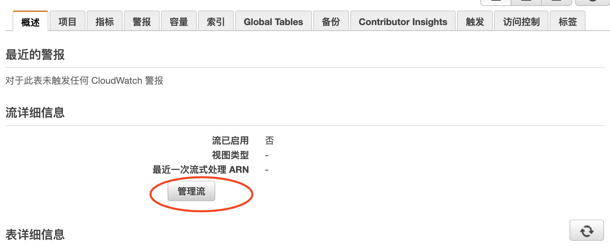
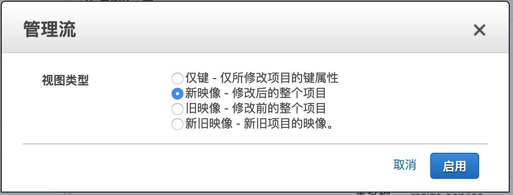
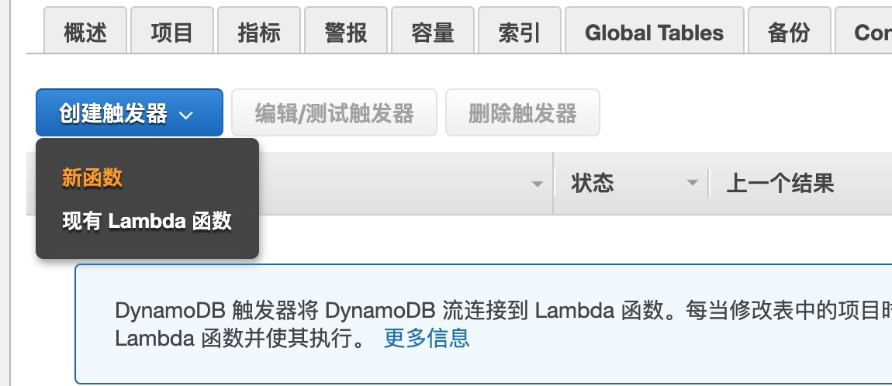
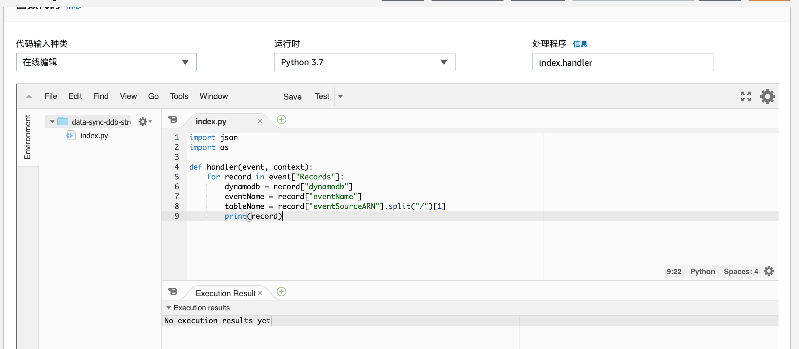

## Dynamodb触发器

### 开通Dynamodb Stream 流服务






### 快速开始

```
import json
import os

def handler(event, context):
    for record in event["Records"]:
        dynamodb = record["dynamodb"]
        eventName = record["eventName"]
        tableName = record["eventSourceARN"].split("/")[1]
        print(record)
```


### 将变更的数据发送到消息队列

```
import json
import os

# 消息队列名称
STREAM_NAME = "data-dist"
kinesis = boto3.client('kinesis')

def handler(event, context):
    for record in event["Records"]:
        dynamodb = record["dynamodb"]
        eventName = record["eventName"]
        tableName = record["eventSourceARN"].split("/")[1]
        kinesis.put_record(StreamName=STREAM_NAME, Data=json.dumps(dynamodb))

```

#### 启用了流的表的最大写入容量

每个表 – 40000 个写入容量单位


