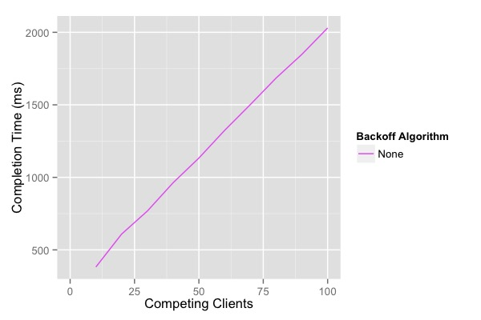
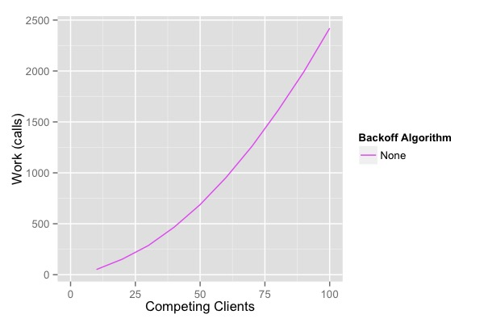
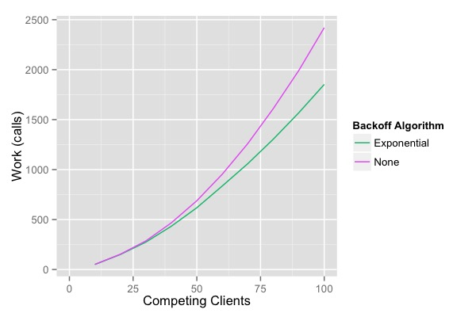
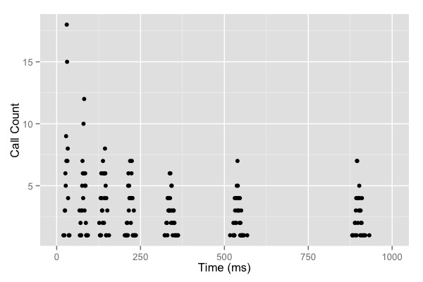
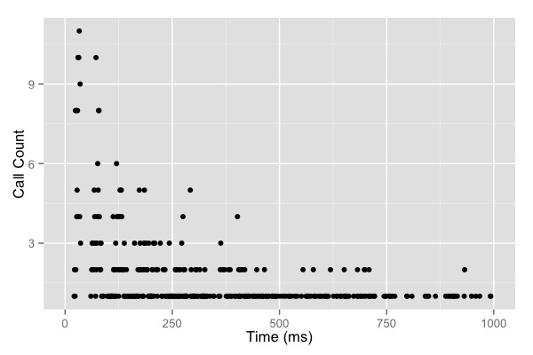
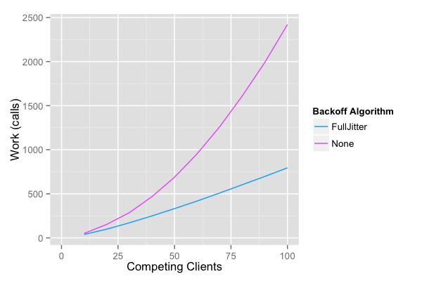
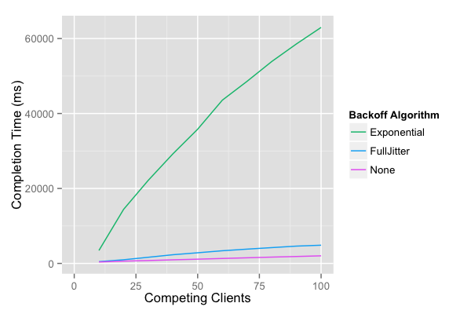

## Dynamodb错误处理

### 介绍
     Dynamodb 一般具有读写限制,当有短暂的突发流量 Dynamodb会读取或写入阀值异常.遇到这种错误怎么进行有效的回避

### 介绍OCC

乐观并发控制（OCC）是一种比较著名的方式，它使多个编写器可以安全地修改单个对象而不会丢失写操作。OCC具有三个不错的属性：只要底层存储是可用的，就可以稳定运行.它容易理解，并且易于实现。

虽然OCC可以保证取得进展，但是在高并发的情况下，它的性能仍然很差。这些高并发的情况中最简单的一种情况是，大量客户端同时启动，并试图更新相同的数据。为了保证客户端都能执行成功，所有更新的时间随着客户端竞争所用的时间是线性增长的。

对于这篇文章中的图，我使用了一个小型程序模拟OCC在具有延迟(和延迟差异)的网络上对远程数据库的行为。在这个模拟中，网络引入的延迟均值为10ms，方差为4ms。第一个程序演示了完成时间如何随争用线性增长。这种线性增长是因为每轮只有一个客户成功，所以所有N个客户需要N轮才能成功。



不幸的是，这还不是全部。在N个客户端竞争的情况下，系统完成的工作总量随N2的增加而增加。



### 添加退避

这里的问题是，第一轮有N个客户端竞争，第二轮有N-1个客户端竞争，依此类推。让每个客户端在每一轮竞争中都是浪费的。降低客户端速度可能会有所帮助，并且降低客户端速度的经典方法是限制指数补偿。上限指数退避意味着每次尝试后，客户端的退避乘以一个常数，直到某个最大值。在我们的情况下，每次失败尝试后，客户端都会睡眠一段时间：

```
sleep = min(cap,base * 2 * attemp)
```

再次运行表明，没有取得很好的效果，客户端工作量仅略有减少。




解决此问题的最佳方法是查看这些指数回退的调用发生的时间。



显然，指数补偿正在起作用，因为调用的发生频率越来越低。这个问题也很突出：仍然有很多调用。我们没有减少每轮竞争中的客户端数量，而是介绍了没有客户端竞争的时间。尽管网络延迟的自然变化带来了一定程度的扩散，但竞争并未减少很多。

### 增加抖动

解决方案不是消除退避。这是增加抖动。最初，抖动可能看起来是违反直觉的想法：尝试通过增加随机性来提高系统性能。上面的时间序列为抖动提供了一个很好的例子–我们希望将尖峰散布为大致恒定的速率。

```
sleep = random_bettween(0,min(cap,base*2**attemp))
```


那个时间序列看起来好多了。差距消失了，而且超出了最初的峰值，调用几乎保持恒定。这对调用总数也有很大的影响。



在有100个客户端的情况下，调用次数减少了一半以上。与无抖动的指数补偿相比，大大缩短了完成时间。




有几种方法可以实现这些定时退避循环。让我们将上述算法称为“全抖动”，并考虑两种选择。第一种选择是“ Equal Jitter”，在这种情况下，总是将一些退避和抖动保持较小的量：

```
temp = min(cap,base * 2 ** attemp)
sleep = temp / 2 +random_between(0, temp / 2)
```

它可以防止非常短暂的睡眠，并始终保持一些减慢的速度。第二种选择 “全抖动”，也会根据最后的随机值增加最大抖动。

```
sleep = min(cap , random_between(base,sleep*3))
```


### 原文

* [Dynamodb错误处理](https://docs.aws.amazon.com/zh_cn/amazondynamodb/latest/developerguide/Programming.Errors.html)

* [代码实现](https://github.com/aws-samples/aws-arch-backoff-simulator/blob/master/src/backoff_simulator.py)